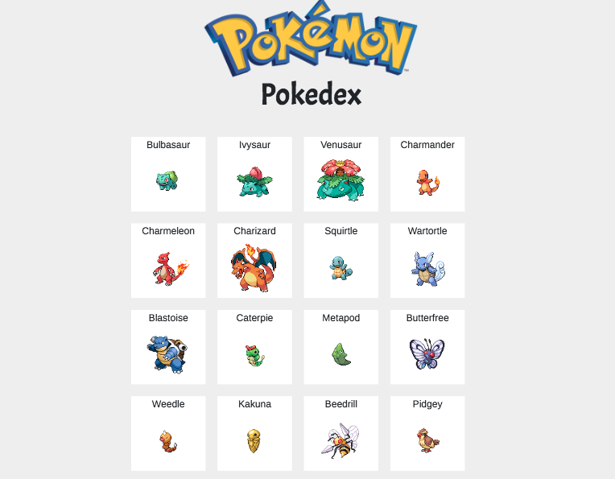
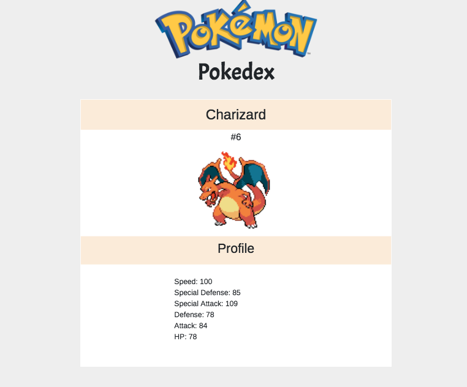
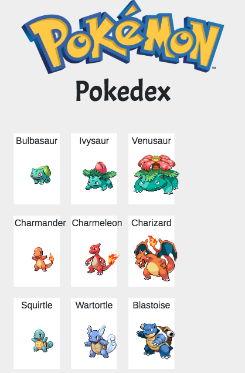
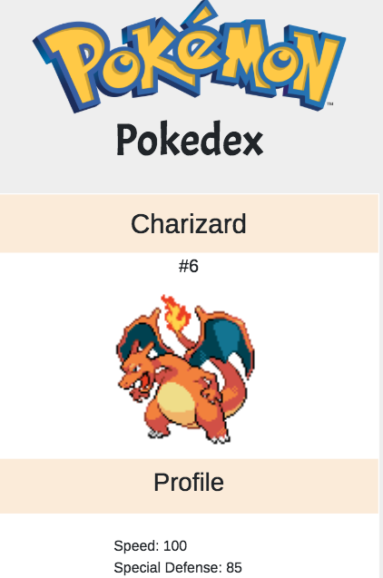

# Pokedex

* **Curso:** _Construye una single page app(SPA) multi-usuario consumiendo data remota_
* **Unidad:** _¿Qué significa traer datos de un servidor asíncronamente?_

***

En este ejercicio se consume la API de Pokeapi, se diseña un pokedex. Se utilizan conceptos de jQuery, Ajax, responsive Web Design y Bootstrap.

## Visualización desktop

## Visualización mobile 

